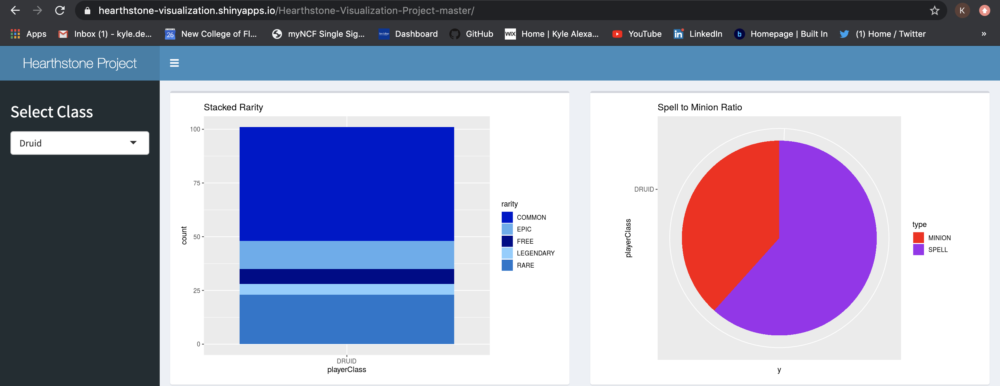
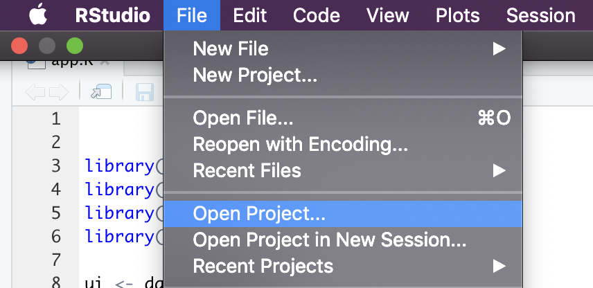
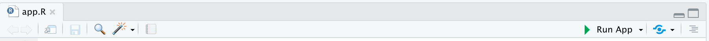

# Hearthstone Visualization Project

A video demo of this project can be found at https://youtu.be/pWRgTJTpIv0

This is a project that was created as a final project for a Data Visualization course from Feburary to March 2018. The goal of this project was to create a Shiny app that presents four visualizations of interesting information for each playable class in Hearthstone using data collected from http://www.hearthstonetopdecks.com/. This project was sucessful in creating multiple useful visualizations like a stacked bar chart of card rarities, pie chart of spells to minions ratio, bar chart of minions health, and a box-and-whisker plot of mana costs compared to rarity. 

The Hearthstone Visualization Design Paper explains the inspiration for the project, its intended audience, and why each visualization was chosen. It also explains the characteristics of the cards found in the cards.csv file and how they work in the context of games in Hearthstone.  

### Getting Started 
There are two options for running this project the first is to visit the live URL https://hearthstone-visualization.shinyapps.io/Hearthstone-Visualization-Project-master/. The other options is to run the project locally from inside RStudio. To accomplish this start by downloading and opening HearthstoneVisualization.Rproj inside of Rstudio. 

Then inside the project open the app.R file and click the Run App button

### Built With 

* RStudio - IDE
* Shiny - Adds user interactivity

### Authors 

* Kyle Dennison - KyleDennison

